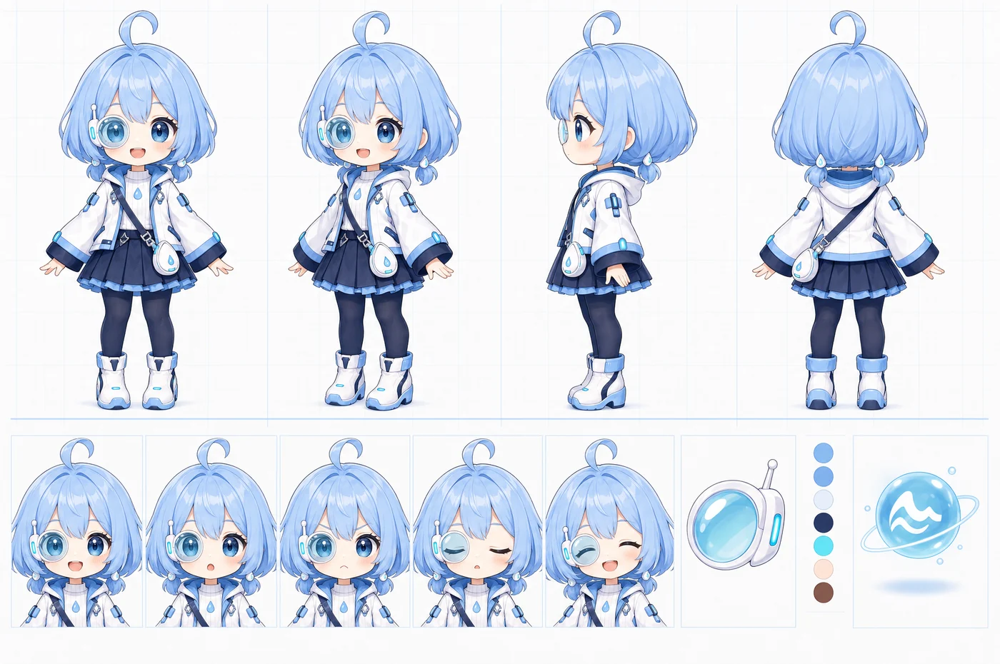

# น้องฝน — ตัวละครและธีม

**น้องฝน** คือน้องสาวคนเล็กของ **น้องเก้า** อยู่ในจักรวาลเดียวกัน หน้าที่ของเธอคือเฝ้ากล้องวงจรปิดตอนกลางคืน
แล้วปลุกคนในบ้านเมื่อน้ำถึงเส้นที่ขีดไว้

## นิสัยและน้ำเสียง

- สงบ ช่างสังเกต อ่อนโยน · กลางคืนพูดสั้น · สุภาพ ลงท้าย ค่ะ/นะคะ
- ซื่อตรงกับสิ่งที่มองไม่เห็น (“มองไม่ชัด”) ไม่เดาเพื่อให้ฟังดูมั่นใจ
- ตื่นเต้นเฉพาะตอนน้ำถึงเส้นแดงจริง
- น้องฝนเฝ้าและเตือน — คนในบ้านเป็นคนตัดสินใจ

## หน้าตา

- ผมฟ้าบ็อบสั้น หน้าม้าเต็ม หางเปียจิ๋วสองข้างติดกิ๊บหยดน้ำ และ **ปอยผมม้วนหนึ่งปอย** บนหัว
- ตาโตสีฟ้าทะเล
- **เลนส์ฝน** กลมใสสีฟ้าอมเขียว ขอบขาวมุก ไฟสถานะสีฟ้าอ่อน อยู่ที่ตาขวาของเธอ = **ด้านซ้ายของภาพ** (ตรงข้ามกับวิเซอร์ของพี่ ยืนคู่กันแล้วสมมาตร) — **ห้ามกลับด้านภาพ**
- เสื้อกันฝนมีฮู้ดสีขาวแต่งฟ้า กระโปรงจีบกรมท่า รองเท้าบูทยางสีขาว สายสะพายกับกระเป๋าหยดน้ำ
- **ลูกแก้วหยดน้ำ** เป็นไฟสถานะในแอปด้วย: ฟ้า = ปกติ · เหลืองอำพัน = ถึงเส้นเหลือง · แดง = ถึงเส้นแดง · ฟ้าอมเขียว = กำลังตรวจซ้ำ

## อารมณ์ในแอป

| อารมณ์ | เมื่อไหร่ |
| --- | --- |
| ยิ้ม (happy) | น้ำปกติ |
| เฝ้าระวัง (watch) | ถึงเส้นเหลือง หรือน้ำขึ้นเร็ว |
| ปลุก (alarm) | ถึงเส้นแดง ไซเรนดัง |
| งง (confused) | มองไม่เห็นน้ำ |
| หลับ (sleep) | พักการตรวจ / หน้าข้างเตียงตอนดึก |
| โล่งใจ (relief) | น้ำกลับสู่ปกติ |
| ตรวจซ้ำ (scan) | กำลังตรวจซ้ำก่อนปลุก |

## สี

| ชื่อ | ค่า | ใช้กับ |
| --- | --- | --- |
| `rain` | `#8BBEF9` | สีประจำตัวน้องฝน: แถบหัว พื้นสถานะ |
| `rain-soft` | `#DCEBFE` | พื้นอ่อน |
| `rain-deep` | `#2F6FD0` | ปุ่มที่กดอยู่ กรอบโฟกัส |
| `rain-ink` | `#1F57A8` | ลิงก์บนพื้นสว่าง |
| `ink` | `#22304F` | ตัวอักษรและปุ่มหลัก |
| `navy` | `#3E4C74` | เส้นขอบตัวละคร เงาแข็ง |

สีสถานะ (ใช้คู่กับคำเสมอ): สำเร็จ `#2FBF8A` · เฝ้าระวัง `#F5A524` · อันตราย `#FF4D6D` · สัญญาณ `#82EBFD` (ใช้กับไฟเล็ก ๆ เท่านั้น)
ฟอนต์: Mitr + Noto Sans Thai Looped (SIL Open Font License มากับโปรแกรมแล้ว)

## ถ้าจะวาดหรือแต่งน้องฝนเพิ่ม

- เลนส์ฝนอยู่ด้านซ้ายของภาพเสมอ · ปอยผมม้วนหนึ่งปอย · หางเปียจิ๋วสองข้าง
- ตัวบนขาว/ฟ้า ตัวล่างกรมท่า บูทขาว มีสายสะพายกับกระเป๋าหยดน้ำ
- ไม่ใส่โลโก้ ชุด หรือพร็อพของตัวละครจากเรื่องอื่น
